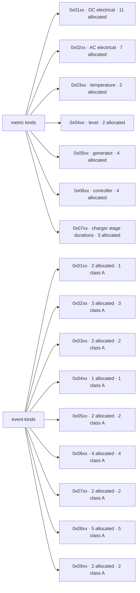

# KM43 — the map

<p class="o89-doc-kicker">KM43 / generated overview</p>

<p class="o89-doc-deck">The protocol in three views: how authentication changes through a connection, which numeric ranges remain free, and where a new metric or event kind belongs.</p>

<dl class="o89-doc-facts">
<div>
<dt>Status</dt>
<dd>Generated and non-normative</dd>
</div>
<div>
<dt>Source</dt>
<dd><code>protocol.toml</code></dd>
</div>
<div>
<dt>Shows</dt>
<dd>Authentication, allocation, and families</dd>
</div>
<div>
<dt>Regenerate</dt>
<dd><code>cargo xtask registry</code></dd>
</div>
</dl>

<nav class="o89-doc-links" aria-label="Related KM43 documents">
<a href="/km43/registry/">Number registry <span aria-hidden="true">→</span></a>
<a href="/km43/specification/">Specification <span aria-hidden="true">→</span></a>
<a href="/km43/controller-link/">Controller link <span aria-hidden="true">→</span></a>
</nav>

Generated from [`protocol.toml`](../../crates/km43/protocol.toml). The rules themselves remain in [PROTOCOL.md](../PROTOCOL.md) and [LINK.md](LINK.md); where a picture and a requirement disagree, the requirement wins.

## What protects each message

Grouped by the authentication rule the registry gives it, which is also roughly the order a connection meets them. Each node carries its request opcode and rule, then its response opcode and rule.

```mermaid
flowchart TD
  subgraph Beforeanykeyexists["Before any key exists"]
    Discover["Discover<br/>0x00 none → 0x80 none"]
  end
  subgraph Enrolmentprintedsecretandsomebodyatthepanel["Enrolment — printed secret, and somebody at the panel"]
    Pair["Pair<br/>0x0B pair_key → 0x8B pair_key"]
  end
  subgraph Handshakeprovingaclientkey["Handshake — proving a client key"]
    Hello["Hello<br/>0x01 proof → 0x81 rsp"]
  end
  subgraph Insession["In session"]
    Snapshot["Snapshot<br/>0x02 wrq → 0x82 rsp"]
    Subscribe["Subscribe<br/>0x03 wrq → 0x83 rsp"]
    Event["Event<br/>unsolicited · 0x04 evt"]
    ReadLog["ReadLog<br/>0x05 wrq → 0x85 rsp"]
    GetConfig["GetConfig<br/>0x06 wrq → 0x86 rsp"]
    SetConfig["SetConfig<br/>0x07 signed → 0x87 rsp"]
    Command["Command<br/>0x08 signed → 0x88 rsp"]
    Firmware["Firmware<br/>0x09 signed → 0x89 rsp"]
    Time["Time<br/>0x0A signed → 0x8A rsp"]
    Goodbye["Goodbye<br/>0x0C wrq → 0x8C rsp"]
    Inventory["Inventory<br/>0x0D wrq → 0x8D rsp"]
    Readings["Readings<br/>0x0E wrq → 0x8E rsp"]
    Concerns["Concerns<br/>0x0F wrq → 0x8F rsp"]
    History["History<br/>0x10 wrq → 0x90 rsp"]
    Error["Error<br/>unsolicited · 0xFF rsp_or_bare"]
  end
  subgraph TheinternalUART["The internal UART"]
    LinkUp["LinkUp<br/>0x60 → 0xE0 · either side"]
    Heartbeat["Heartbeat<br/>0x61 → 0xE1 · either side"]
    ClientConnected["ClientConnected<br/>0x62 → 0xE2 · comms → controller"]
    ClientDisconnected["ClientDisconnected<br/>0x63 → 0xE3 · comms → controller"]
    CloseConnection["CloseConnection<br/>0x64 → 0xE4 · controller → comms"]
    NetConfig["NetConfig<br/>0x65 → 0xE5 · controller → comms"]
    TimeOffer["TimeOffer<br/>0x66 → 0xE6 · comms → controller"]
    CommsRelease["CommsRelease<br/>0x67 → 0xE7 · controller → comms"]
    EnterDownload["EnterDownload<br/>0x68 → 0xE8 · controller → comms"]
    PairingWindow["PairingWindow<br/>0x69 → 0xE9 · controller → comms"]
  end
  Beforeanykeyexists --> Enrolmentprintedsecretandsomebodyatthepanel
  Enrolmentprintedsecretandsomebodyatthepanel --> Handshakeprovingaclientkey
  Handshakeprovingaclientkey --> Insession
```



## What is allocated, and what is left

A table of allocated numbers cannot show a gap, and a gap is the only thing somebody allocating the next number needs to see.

```text
client requests — 0x00 to 0x5F, 16 allocated, 80 free
  0x00  ####.### ######## #....... ........
  0x20  ........ ........ ........ ........
  0x40  ........ ........ ........ ........

link-local requests — 0x60 to 0x7E, 10 allocated, 21 free
  0x60  ######## ##...... ........ .......

client responses — 0x80 to 0xDF, 16 allocated, 80 free
  0x80  ####.### ######## #....... ........
  0xA0  ........ ........ ........ ........
  0xC0  ........ ........ ........ ........

link-local responses — 0xE0 to 0xFE, 10 allocated, 21 free
  0xE0  ######## ##...... ........ .......

client errors —    1 to   32, 18 allocated, 14 free
     1  ######## ######## ##...... ........

link-local errors —  256 to  287, 9 allocated, 23 free
   256  ######## #....... ........ ........

```

The two error spaces run further than shown — a client code is a `u16` and the link-local range ends at 511. The window is where the next one would go.

`0x7F` is absent from the link-local range on purpose: `0x7F` with the high bit set is `0xFF`, which is `Error`.

## Where a new kind goes

The high byte is the family. A kind allocated in the wrong one is not wrong on the wire and is wrong for everybody reading a log.



`0xF000`–`0xFFFF` is vendor and experimental in both spaces and is never allocated here.
